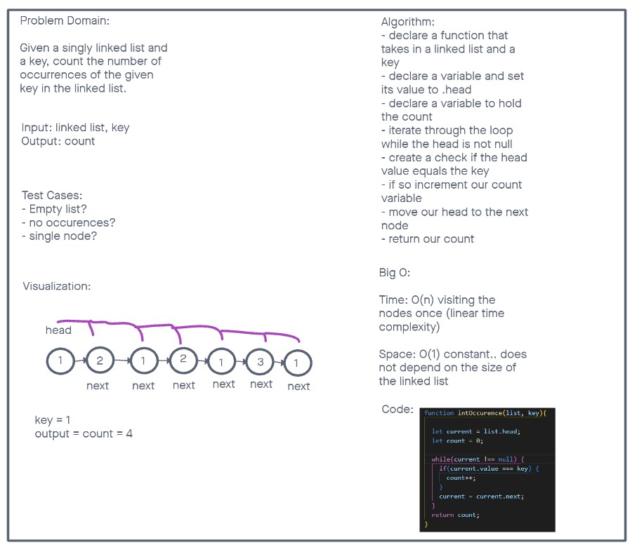

# Linked List Integer Occurence

Given a singly linked list and a key, count the number of occurrences of the given key in the linked list.

If the given linked list is 1->2->1->2->1->3->1 and the given key is 1, then the output should be 4.

From: [geeks4geeks](https://www.geeksforgeeks.org/write-a-function-that-counts-the-number-of-times-a-given-int-occurs-in-a-linked-list/?ref=gcse)

## Approach

Traverse the linked list from the head to the end and count the occurrences of the key. We start with a count of 0 and a current node pointing to the head of the list. We iterate through each node, checking if its value matches the given key. If it does, we increment the count. Finally, we return the count as the total number of occurrences.

## Whiteboard

