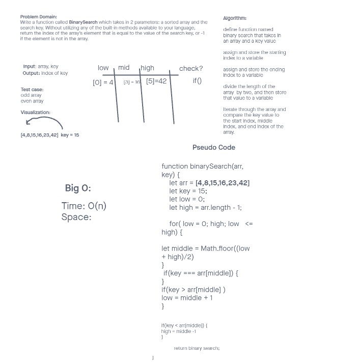

# Array-Binary-Search

Write a function called BinarySearch which takes in 2 parameters: a sorted array and the search key. Without utilizing any of the built-in methods available to your language, return the index of the array’s element that is equal to the value of the search key, or -1 if the element is not in the array.

## Whiteboard

> Whiteboard was done with Malik Sadiki-Torres.

## Approach and Efficiency

- declare high, and low variables

- iterate through array as long as low is less then or equal to high.

- find middle index and compare it to key.
