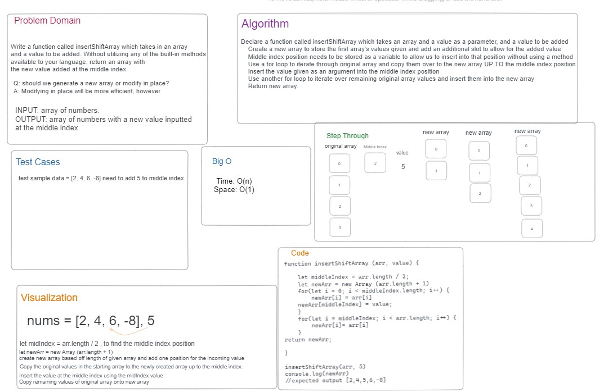

# Array-Insert-Shift

Write a function called `insertShiftArray` which takes in an array and a value to be added. Without utilizing any of the built-in methods available to your language, return an array with the new value added at the middle index.

## Whiteboard

> Whiteboard was done with Reece Renninger.

## Approach and Efficiency

- find the middle index. Store the value.
