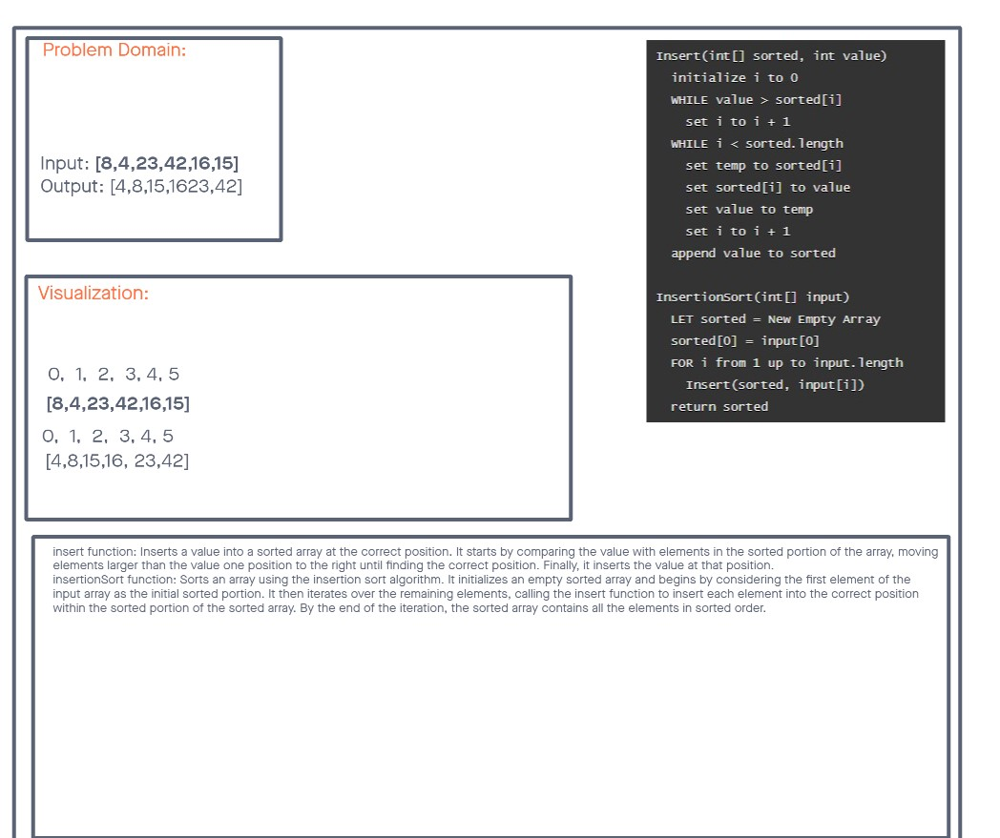

# insertion-sort

Selection Sort is a sorting algorithm that traverses the array multiple times as it slowly builds out the sorting sequence. The traversal keeps track of the minimum value and places it in the front of the array which should be incrementally sorted.

## Collaborations

ChatGPT for help with tests..

- Francisco

- Ike

- Nick M.

- Ryan E.

- Reece

## Whiteboard

