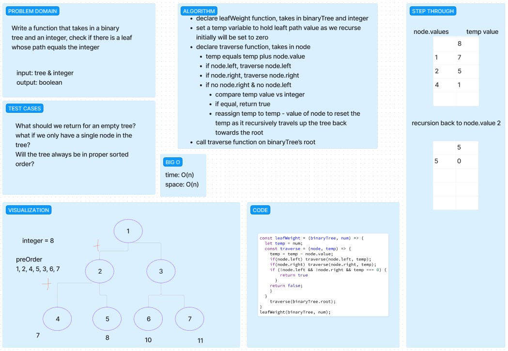

# leafWeight-BinaryTree

- Write a function that takes in a binary
tree and an integer, check if there is a leaf whose path equals the integer

- Input: tree & integer
- Output: boolean

## Collaboration

- Ike
- Reece
- Ryan E.

## Whiteboard

