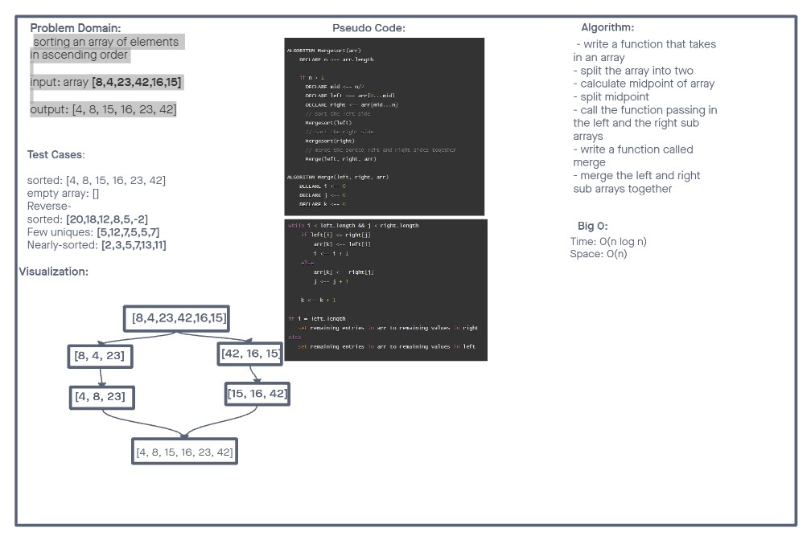

# merge-sort

sorting an array of elements in ascending order

- input: array [8,4,23,42,16,15]

- output: [4,8,15,16,23,42]

## Collaborations

ChatGPT for help with tests, and understanding of how to accomplish this.

## Whiteboard

