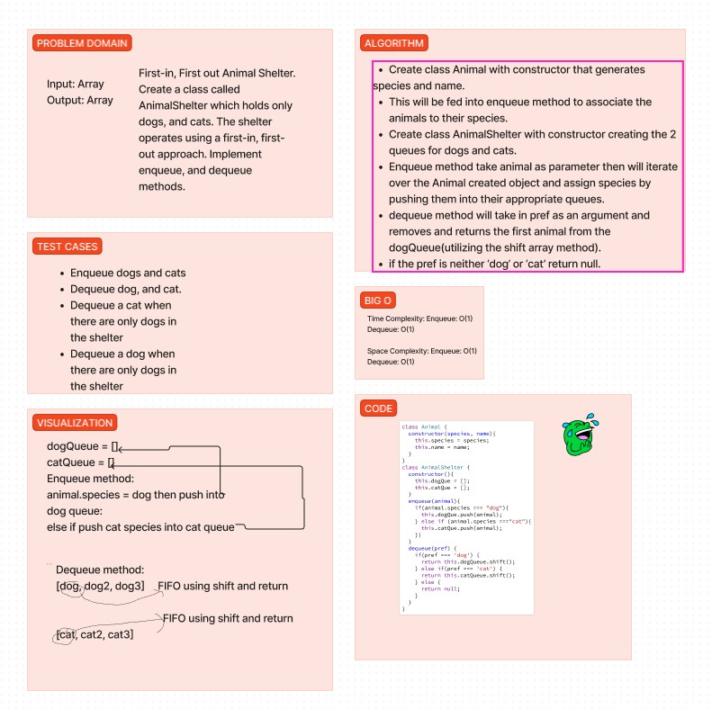

# stack-queue-animal-shelter

First-in, First out Animal Shelter.
Create a class called AnimalShelter which holds only dogs, and cats. The shelter operates using a first-in, first-out approach. Implement enqueue, and dequeue methods.

## Whiteboard

Whiteboard process was done with Reece, and Eva.

## Collaborations

I worked with Reece, and Eva on this code challenge, and also used AI for some help with testing.

## Approach & Efficiency

My partner and I stuck to 45 minutes to get as much of it done that we could. We took the first 5 ish minutes to discuss a game plan.
