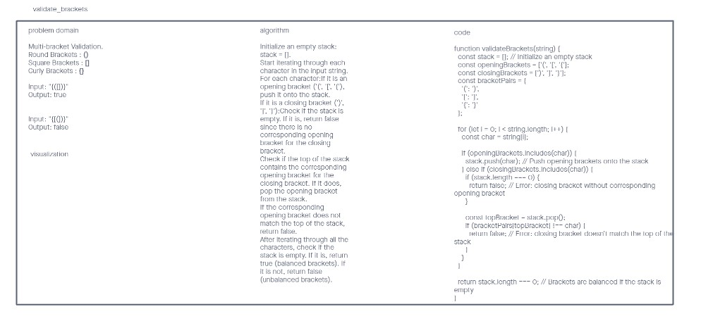

# stack-queue-brackets

Multi-bracket Validation.

Input: A string representing a sequence of brackets.

Output: A boolean value representing whether the brackets in the string are balanced.

## Whiteboard

Whiteboard started solo, and will be updating..

