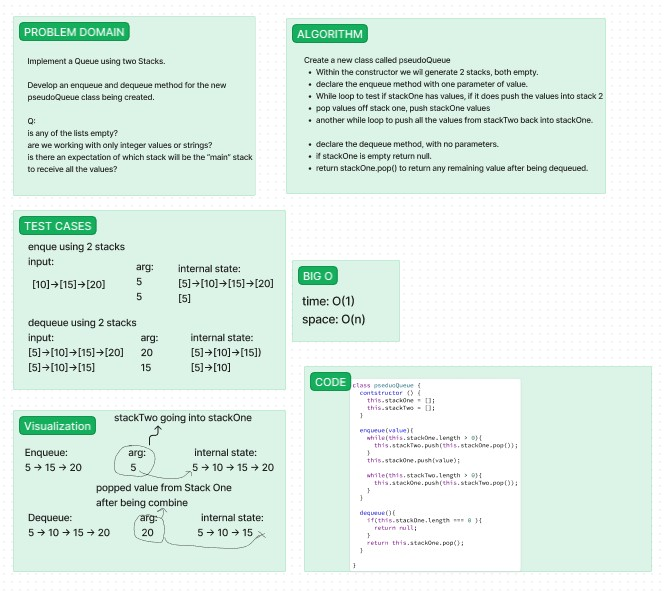

# stack-queue-pseudo

Implement a Queue using two Stacks.

Develop an enqueue and dequeue method for the new
pseudoQueue class being created.

## Whiteboard

Whiteboard process was done with Reece.

## Collaborations

I worked with Reece on this code challenge, and also used AI for some help with testing.

## Approach & Efficiency

My partner and I stuck to 45 minutes to get as much of it done that we could. We were pretty on track until writing the code out ourselves, and that is when we utilized AI.

