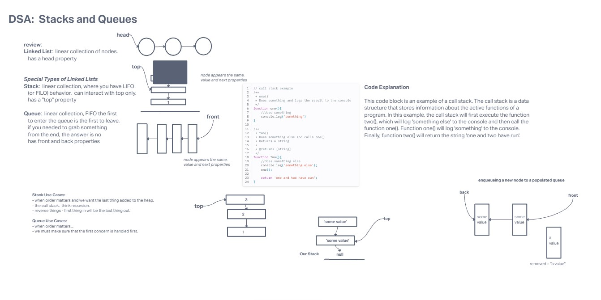

# Stacks and Queues

Using a Linked List as the underlying data storage mechanism, implement both a Stack and a Queue

- Can successfully push onto a stack
- Can successfully push multiple values onto a stack
- Can successfully pop off the stack
- Can successfully empty a stack after multiple pops
- Can successfully peek the next item on the stack
- Can successfully instantiate an empty stack
- Calling pop or peek on empty stack raises exception
- Can successfully enqueue into a queue
- Can successfully enqueue multiple values into a queue
- Can successfully dequeue out of a queue the expected value
- Can successfully peek into a queue, seeing the expected value
- Can successfully empty a queue after multiple dequeues
- Can successfully instantiate an empty queue
- Calling dequeue or peek on empty queue raises exception

## Whiteboard

Whiteboard process is from class lecture with instructor Ryan Gallaway.

## Collaborations

Josh Coffey, reference to instructor Ryan Gallaway demo, and ChatGPT for assistance on the `Calling pop or peek on empty stack raises exception`, and `Calling dequeue or peek on empty queue raises exception` tests.
