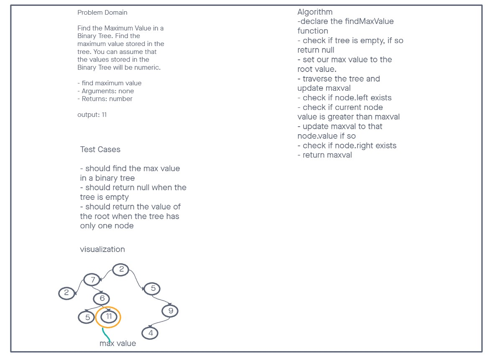

# Binary Tree and BST Implementation

Create a Node class that has properties for the value stored in the node, the left child node, and the right child node.

- Create a Binary Tree class
- Define a method for each of the depth first traversals:
- pre order
- in order
- post order

## Collaborations

Reference to Code Review from instructor Ryan Gallaway. Utilized GPT for assistance with tests.

## Tree-Max

Find the Maximum Value in a Binary Tree.

Write the following method for the Binary Tree class

- find maximum value
- Arguments: none
- Returns: number

Find the maximum value stored in the tree. You can assume that the values stored in the Binary Tree will be numeric.

## Approach & Efficiency

## Collaborations DSA-16

## Whiteboard

