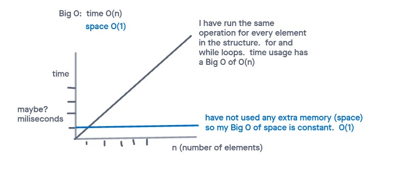
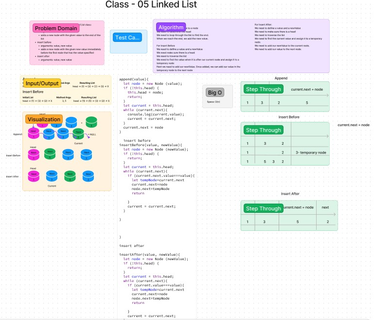

# Linked Lists

Write tests to prove the following functionality:

Can successfully instantiate an empty linked list
Can properly insert into the linked list
The head property will properly point to the first node in the linked list
Can properly insert multiple nodes into the linked list
Will return true when finding a value within the linked list that exists
Will return false when searching for a value in the linked list that does not exist
Can properly return a collection of all the values that exist in the linked list

### Approach & Efficiency

### Solution

`npm test linked-list.test.js`

### Collaboration

Reference to demo code as well as reading material from linked list readings.

## Challenge 06

Write the following methods for the Linked List class:

### append

- arguments: new value
adds a new node with the given value to the end of the list

### insert before

- arguments: value, new value
adds a new node with the given new value immediately before the first node that has the value specified

### insert after

- arguments: value, new value
adds a new node with the given new value immediately after the first node that has the value specified.

